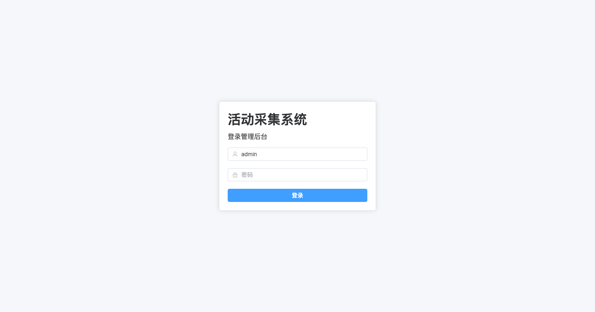
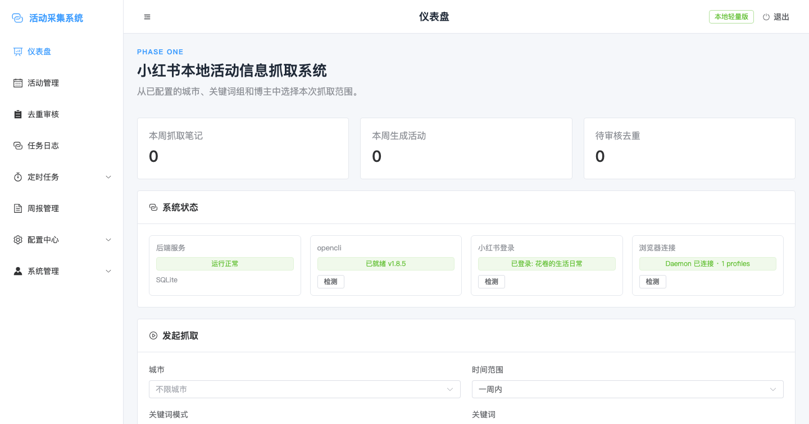
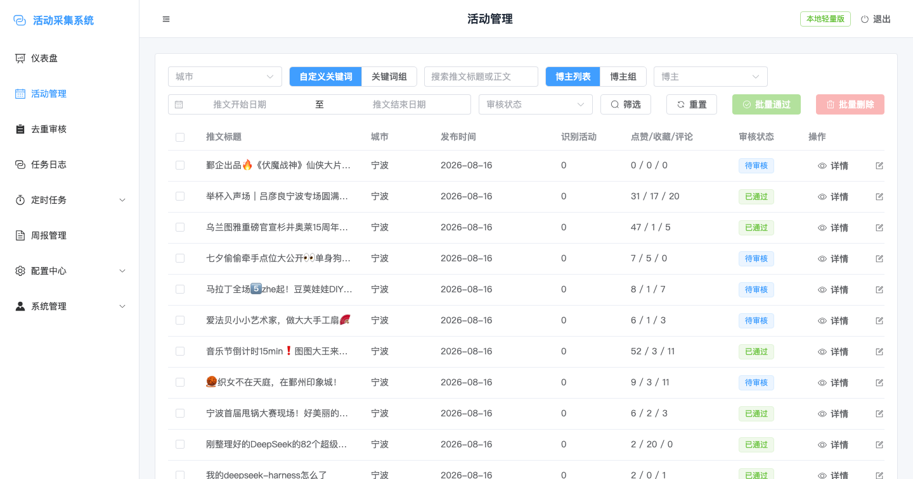
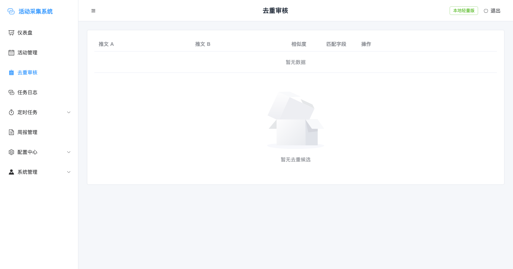
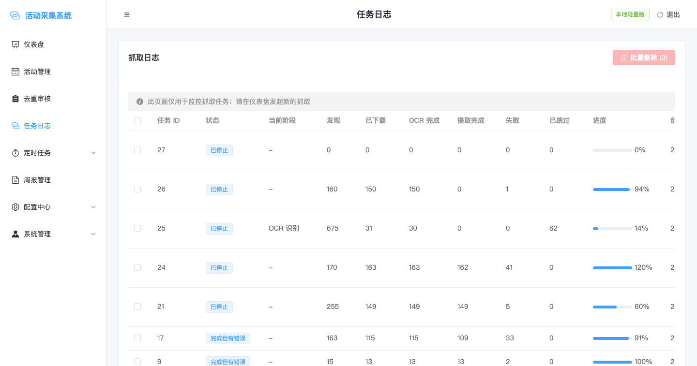
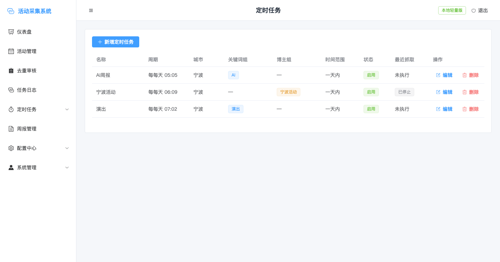
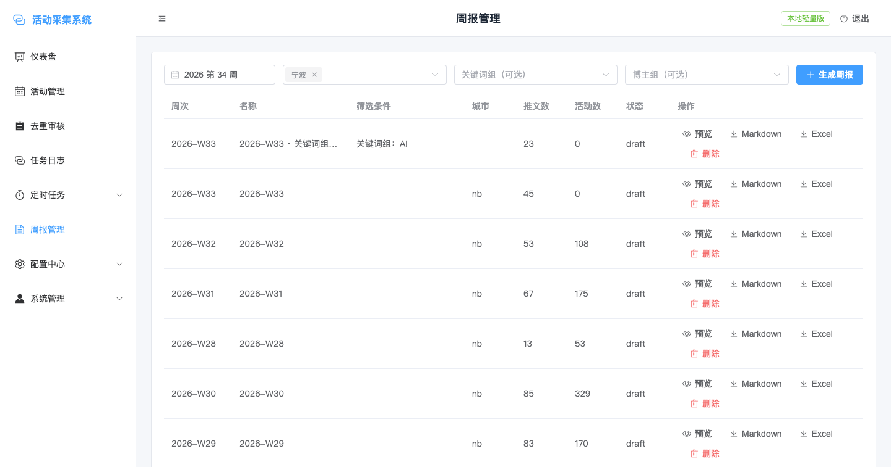
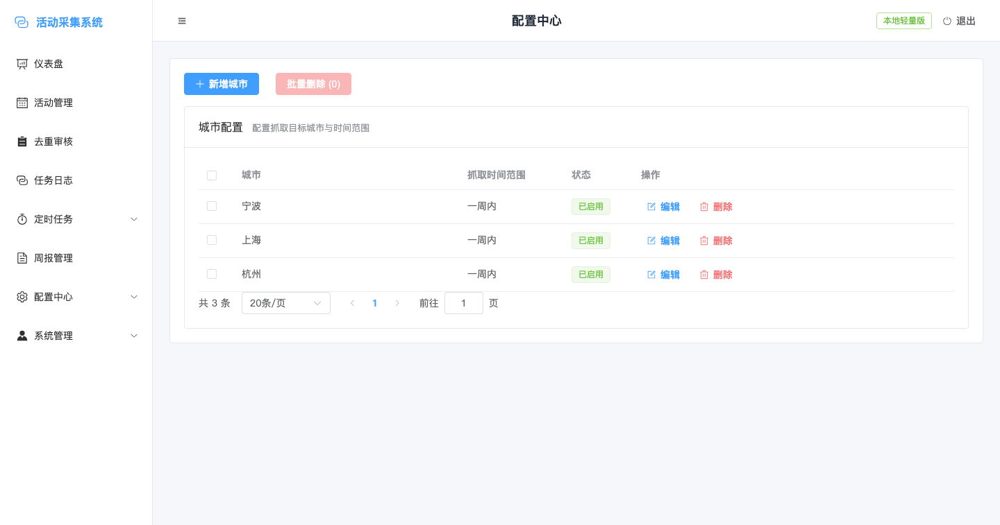
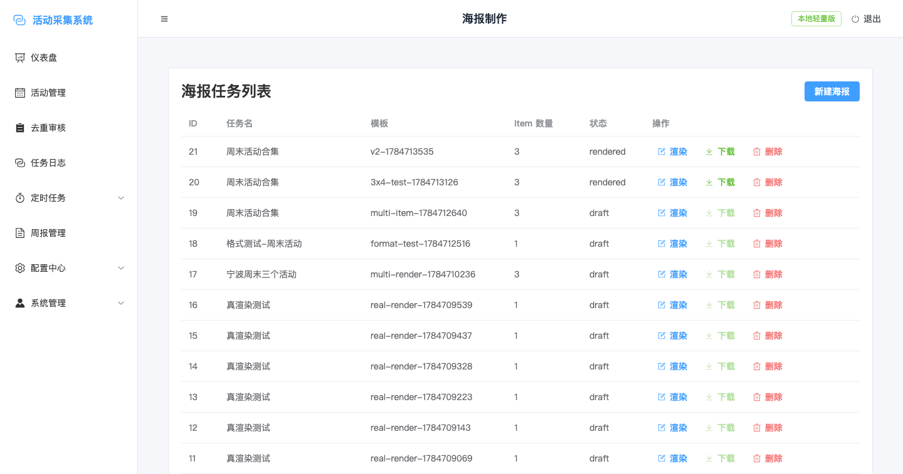
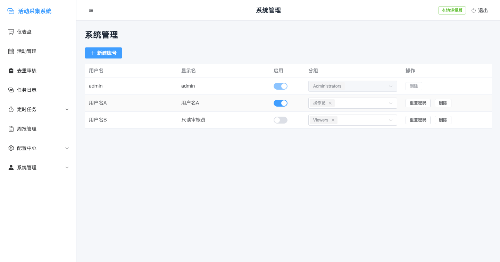

# xhs-info-crawl · 小红书本地活动信息抓取系统

A local-first system that scrapes local event information from Xiaohongshu (小红书), runs OCR + LLM extraction, and outputs Markdown / Excel reports.

> 当前发版：**v0.6.0**（launcher UI hardening + 端口自适应 + 后端存储 base-dir）。详见 [`CHANGELOG`](#changelog--版本说明) 或 `git tag -l`。
>
> 终端用户（不写代码）请直接看 [`README-USER.md`](README-USER.md)：下载 `.zip` → 双击 `.app` → 浏览器登录 → 抓取 → 周报。

本仓库采用两阶段交付：

- **阶段一（当前）**：本地单机，Vue 3 + FastAPI + Celery + SQLite + filesystem broker + 本地文件存储。
- **阶段二（路线图中）**：PostgreSQL + Redis + MinIO + Docker Compose 部署。

## 文档导航

| 文档 | 读者 | 内容 |
|---|---|---|
| [`README.md`](README.md)（本文） | 开发者 / 维护者 | 仓库结构、命令清单、当前版本功能清单、页面预览 |
| [`README-USER.md`](README-USER.md) | 终端用户 | 安装启动、OpenCLI / OCR 配置、日常使用、常见问题 |
| [`INSTALL.md`](INSTALL.md) | 开发者 | 从源码拉起开发环境的完整步骤（含 SQLite、Celery、Vite） |
| [`SPEC.md`](SPEC.md) | 开发者 | 阶段一系统设计 |
| [`AGENTS.md`](AGENTS.md) | AI 协作者 | TDD / Spec 流程、提交约定、worker 重启规则 |
| [`assets/screenshots/`](assets/screenshots) | 全员 | 管理端页面截图（v0.6.0 实拍） |

> `docs/` 目录下的设计文档（路线图 / API 文档 / 数据库设计 / UI 设计 / 爬虫设计 / 架构）**仅作本地开发参考，不入库**（见 `.gitignore`）。如需查阅请在本地 checkout 后阅读，或直接看代码注释。

---

## 快速开始（Quick Start · 开发者）

需要本地装了 `uv` + Node 22+ + Chrome + OpenCLI。

```bash
git clone https://github.com/hyqskevin/xhs-info-crawl.git
cd xhs-info-crawl
make init                     # 装依赖、建表、seed admin
```

开四个终端（每个跑一条 `make` 命令）：

```bash
make dev-api      # uvicorn → http://127.0.0.1:8000
make dev-worker   # celery worker (1 concurrency)
make dev-beat     # celery beat
make dev-web      # vite dev → http://127.0.0.1:5173
```

浏览器打开 <http://127.0.0.1:5173>，登录 `admin / Admin@123`（从 `.env` 中的 `ADMIN_PASSWORD`）。配置中心先建一条城市与博主，再到仪表盘发起抓取即可。

> 详细的"安装、测试、迁移、备份" 见 [`INSTALL.md`](INSTALL.md)。

### 快速开始（终端用户 · 打包版）

直接下载 [`Releases`](https://github.com/hyqskevin/xhs-info-crawl/releases) 里的 zip：

- **macOS**：`xhs-info-crawl-<version>-macos.zip` → 解压 → 右键 `.app` "打开" → 启动器窗口弹出 → 点击"打开网页"。
- **Windows**：`xhs-info-crawl-<version>-windows.zip` → 解压 → 双击 `start.bat`。

完整图文步骤：[`README-USER.md`](README-USER.md)。

---

## 仓库结构

```
xhs-info-crawl/
├── README.md                ← 你正在读（开发者总览）
├── README-USER.md           ← 终端用户使用手册
├── INSTALL.md               ← 开发者安装与初始化
├── AGENTS.md                ← AI 协作流程
├── SPEC.md                  ← 阶段一系统设计
├── Makefile                 ← 顶层快捷命令
├── .env.example             ← 环境变量样例
├── scripts/                 ← init / create-admin / backup / dev-* shims
├── backend/                 ← FastAPI + SQLAlchemy + Alembic + Celery
│   ├── app/
│   │   ├── api/v1/          ← HTTP endpoints
│   │   ├── models/          ← SQLAlchemy ORM
│   │   ├── services/        ← 业务服务（dedup / extraction / opencli 等）
│   │   ├── tasks/           ← Celery 任务
│   │   └── core/            ← config / database / security
│   ├── migrations/          ← Alembic 版本
│   ├── scripts/             ← 数据回填 / 修复脚本
│   └── tests/               ← pytest
├── frontend/                ← Vue 3 + Vite + Element Plus + Pinia
│   ├── src/views/           ← 仪表盘 / 活动管理 / 抓取日志 / 周报 / 重复项 / 配置中心 / 海报 / 系统管理
│   ├── e2e/                 ← Playwright
│   └── package.json
├── launcher/                ← 打包版桌面启动器（PyWebView）
│   ├── ui/                  ← Vue 3 写的启动器窗口 UI
│   ├── main.py              ← 启动器主入口（启动后端 + 打开窗口）
│   ├── process_manager.py   ← uvicorn / celery worker / beat / status_server 进程管理
│   ├── status_server.py     ← 启动器内部 HTTP API（端口探测、OCR 安装等）
│   └── ...
├── docs/                    ← 设计 / specs / 路线图 / API / 截图
│   └── screenshots/         ← 管理端页面截图
└── tests/                   ← E2E 测试案例（md）
```

---

## 当前已实现的功能（v0.6.0）

✅ = 已完成

### 抓取与活动管理

- ✅ **仪表盘**：选择城市 + 关键词/关键词组 + 博主/博主组发起抓取；4 行布局（城市+时间范围｜关键词模式+关键词｜博主模式+博主｜操作账号）；关键词组可不挂城市（不限城市抓取）；博主组跨城市；本周抓取数/活动数/待审核 KPI 卡
- ✅ **活动管理**：城市 / 关键字 / 关键字组 / 博主 / 博主组 / 时间范围 / 审核状态 7 维过滤；单条与批量通过 / 删除；编辑推文标题 / 子活动；标记重新处理
- ✅ **去重审核**：硬键去重 + 软键相似度候选；merge / ignore 操作；空候选时空状态插画
- ✅ **任务日志**：多选批量删除；点击查看任务运行日志（阶段、当前进度、错误信息）
- ✅ **定时任务**：每天定时触发抓取；关键词组 / 博主组挂载；启用 / 停用 / 编辑 / 删除
- ✅ **周报管理**：按周筛选 + 关键词组 / 博主组筛选；预览 / Markdown / Excel 下载

### 配置与账号

- ✅ **配置中心**：城市 / 关键词 / 关键词组 / 博主 / 博主组 / 博主白名单 Excel 批量导入 / 博主信息自动补全；5 个表格均支持分页与批量删除
- ✅ **系统管理（多账号 RBAC）**：账号 / 分组 / 权限 / 审计日志 4 个 tab；`Administrator` 组默认拥有全部权限；新建 editor 账号 → 限定权限 → editor 登录无权限页 403
- ✅ **登录限流**：5 次失败 / 1 分钟 → 5 分钟锁定（防爆破）

### 海报与导出

- ✅ **海报制作**：海报模板管理 + 海报任务向导（选活动 → 选模板 → 渲染 → 下载）；支持多活动排版

### 抓取底层

- ✅ **登录态校验**：发现 xhs 未登录 → 自动暂停 + 保留 Chrome 页面
- ✅ **风控自动暂停**：检测风控弹窗 → 停止任务 + 提示人工介入
- ✅ **安全停止**：用户中止时不丢数据，可续跑
- ✅ **多账号轮询**：每个抓取任务可指定不同的 xhs 登录账号（避免单账号限流）
- ✅ **OCR**：PaddleOCR 提取图片文字（增强包可选安装）
- ✅ **LLM 提取**：MiniMax-M3 从标题 / 正文 / OCR 文本中结构化提取活动字段

### 桌面启动器（打包版）

- ✅ **三服务一键启停**：API / Worker / Beat 在启动器窗口内状态可视化
- ✅ **OpenCLI 连接检测 + 一键下载**：自动检测 Chrome 扩展、CDP 端口、登录态
- ✅ **OCR 增强包一键下载安装**：进度条 + 失败重试
- ✅ **启动器自带 status_server**：端口探测、API 配置互通
- ✅ **退出清理**：正常退出 / SIGTERM / SIGINT / SIGHUP / 未捕获异常 全部路径清理子进程
- ✅ **PyWebView 主线程窗口**：macOS 兼容性保证

### 测试

- ✅ 后端 800+ 测试用例全绿（含 RBAC、登录限流、批量删除、关键词组不限城市、海报任务等）
- ✅ 前端 Vitest + Playwright e2e 全绿
- ✅ `backend/tests/test_project_internal_writes.py` 静态扫描生产代码确保无 `/tmp`、`~`、第三方库缓存外泄

阶段二（路线图中尚未开始）：PostgreSQL / Redis / MinIO / Docker Compose 部署。

---

## 管理端页面一览

> 截图来源：v0.6.0 实拍（admin 登录态），测试数据；博主 ID / 真实账号已在截图时通过前端 JS 脱敏，详见 [`assets/screenshots/`](assets/screenshots)。

### 登录



打开 `http://127.0.0.1:5173/` 后默认跳到登录页。默认账号 `admin`、默认密码 `Admin@123`（首次登录后建议在系统管理里修改）。

### 仪表盘



顶部 3 个 KPI 卡（本周抓取笔记 / 本周生成活动 / 待审核去重），中部 4 个服务状态卡（后端 / opencli / 小红书登录 / 浏览器连接），底部 4 行抓取表单。

### 活动管理



7 维过滤（城市 / 关键词 / 关键词组 / 博主 / 博主组 / 起止日期 / 审核状态），批量审核通过 / 删除，每条可点"详情"查看完整结构化字段。

### 去重审核



展示相似度候选对，可一键 merge（合并到 A）或 ignore（保留两条）。

### 任务日志



每次抓取一行；显示阶段（已停止 / OCR 识别 / 完成但有错误 等）、进度条、发现的笔记 / 已下载 / OCR 完成 / 提取完成 / 失败 / 已跳过计数。

### 定时任务



按计划每天自动抓取；可挂关键词组、博主组、操作账号。

### 周报管理



按周 + 关键词组 + 博主组筛选；预览 / Markdown / Excel 下载。

### 配置中心



城市配置表；其余 5 个 tab（关键词 / 关键词组 / 博主 / 博主组 / xhs 账号）采用同样的"分页 + 批量删除"模式。

### 海报制作



海报任务列表；右侧"新建海报"进入向导页选择活动 + 模板。

### 系统管理



账号 / 分组 / 权限 / 审计日志 4 个 tab。图中 `用户名A` `用户名B` 是脱敏占位（原账号已被替换）。

---

## 常用命令

| 命令 | 作用 |
|---|---|
| `make init` | 安装依赖、建表、seed admin |
| `make dev-api` | 起 FastAPI (uvicorn) |
| `make dev-worker` | 起 Celery worker |
| `make dev-beat` | 起 Celery beat |
| `make dev-web` | 起 Vite dev server |
| `make migrate` | 升级 DB 到最新版本 |
| `make create-admin` | 手动创建/重置 admin |
| `make test` | 后端 + 前端测试 |
| `make build` | 前端生产构建 |
| `make test-e2e` | Playwright E2E |
| `make backup` | 打包 data 目录到 `data/backups/` |

---

## Changelog · 版本说明

仅记录 v0.5.0 之后的关键里程碑。完整 commit 历史见 `git log`。

### v0.6.0 — launcher UI hardening + 端口自适应 + 后端存储 base-dir

- 启动器 UI 全面加固（PyWebView 主线程化 / SIGTERM 清理 / 端口自适应 / API 配置互通）
- 后端图片存储改用 `data_dir` 相对路径，跨机器迁移不再断裂
- 打包版内置 OCR 依赖，无需再单独下载 .addon
- 打包版登录默认密码 `Admin@123`，启动器不再生成随机密码

### v0.5.7 — 退出时彻底清理子进程

- `launcher/process_manager.py` worker 命令改 solo pool（`--pool=solo --concurrency=1`）防 grand-children 泄漏
- `stop_service` 超时后 SIGKILL 整个进程组
- 关窗 / PyWebView 异常 → `pm.cleanup()` 杀全部子进程

### v0.5.6 — 自动生成的初始密码可见 + PyWebView 崩溃保护

- 启动器不再"生成随机密码藏起来"：直接 `admin / Admin@123` 登录
- PyWebView 异常 → `finally: pm.cleanup()` 退出

### v0.5.5 — 前后端端口分离 + 端口自适应 + 配置互通

- API 端口范围 8001-8020，前端端口范围 5173-5199，启动器自动找空闲端口
- 状态服务端口范围 9000-9020
- `WEB_PORT` / `API_PORT` / `API_BASE_URL` 启动时写入 `.env`

### v0.5.4 — 定时任务每天触发校验 + 仪表盘关键词组下拉宽度

- 调度器校验"上一次触发是否在 24 小时内"，缺失则补一次
- 仪表盘关键词组 / 操作账号下拉宽度适配最长标签

### v0.5.0 — 导航权限码细分 + 时区统一 + CDP 端口自动分配

- `view(action)` 权限码替换 `read / write`
- 全项目时区统一 UTC+8
- opencli daemon 端口自动分配到空闲端口

### v0.3.0 — 定时任务 / 仪表盘分析 / 加固

- 引入 Scheduled Crawl（每天定时抓取）
- 仪表盘 KPI 卡 + 趋势图
- 登录限流（5/min → 5min 锁）

### v0.2.0 — 阶段一修订

- 阶段一范围收敛、API 文档定型、SQLite → PostgreSQL 迁移路径预留

### v0.1.0 — 阶段一初始发版

- 单机能跑的完整业务闭环：抓取 → OCR → 提取 → 审核 → 周报

---

## 发版与 Release

- 本仓库使用 SemVer + git tag；
- 每完成 TODO.md 一项就独立提交，累积到一个稳定点打 tag（如 `v0.6.0`）；
- Tag 由维护者在 GitHub *Releases → Draft a new release* 中关联 release notes 并发布，
  任何人可下载 `xhs-info-crawl-vX.Y.Z.zip` 源码包；
- 桌面打包版（macOS `.app` / Windows `.exe`）由 `scripts/package-macos.sh` 等脚本生成，**zip 不入库**（在本地 `dist/build/` 下）；
- Docker / 二进制安装包属于阶段二目标，不在阶段一打包范围。

---

## 路径与数据

| 资源 | 位置 |
|---|---|
| SQLite DB | `data/app.db` |
| 图片存储 | `data/images/` |
| 周报导出 | `data/exports/` |
| 海报产物 | `data/posters/` |
| Celery broker | `data/celery/queue/` |
| Celery results | `data/celery/results/` |
| 备份 | `data/backups/`（`make backup` 生成） |

---

## 反馈与协作

- Issue 区报告 bug 与 feature 需求
- PR 请开新分支
- 详细开发约定：[`AGENTS.md`](AGENTS.md)

---

## License

Private phase-one prototype; licensing to be decided at stage two packaging.